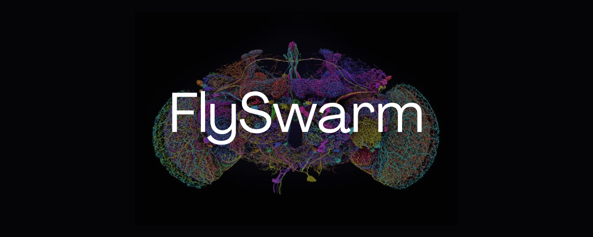

# 🪰 FlySwarm: Swarm CAPTCHA-Breaker

<div align="center">



### *Solving Multi-Modal CAPTCHAs Using Swarm Intelligence and the Whole-Brain Biological Connectome of Drosophila melanogaster*

[](https://www.python.org/)
[](https://nextjs.org/)
[](https://threejs.org/)
[](https://male-cns.janelia.org/)
[](#)
[](#)
[](LICENSE)

[**Explore Architecture**](#-architecture) •
[**Quickstart**](#-quickstart) •
[**Connectome Engine**](#-biological-foundation) •
[**Swarm Consensus**](#-swarm-consensus-mechanism) •
[**3D Lab Arena**](#-real-time-3d-arena--connectome-visualizer)

</div>

---

## 📌 Executive Summary

On September 3, 2026, HHMI Janelia and Google Research released **MaleCNS v1.0** — the first complete, electron-microscopy-reconstructed connectome of an adult male fruit fly's entire central nervous system: **166,700 neurons** and **25,582,938 synaptic connections**.

**FlySwarm** harnesses this real biological neural network to solve complex CAPTCHAs. 

A single biological fly brain processing noisy visual stimuli is prone to errors on heavily distorted patterns. However, when an ensemble swarm of simulated flies views independently perturbed variations of the challenge and votes through a biological consensus mechanism, accuracy dramatically improves across every major CAPTCHA category.

---

## 🔬 Biological Foundation

Unlike conventional artificial neural networks (CNNs or ViTs), FlySwarm runs on biological hardware topology:

* **166,700 Real Neurons**: Complete somatic mapping across optic lobes, central brain (protocerebrum, mushroom bodies, central complex), and the ventral nerve cord (VNC).
* **25,582,938 Synaptic Connections**: Exact graph topology and neurotransmitter weights from HHMI Janelia MaleCNS v1.0.
* **Biophysical Spiking Dynamics**: Leaky integrate-and-fire simulation with membrane potential decay, refractory states, and neurotransmitter polarities (`dt = 20ms`).
* **Visual Projection Encoding**: Input stimuli are mapped past the lamina into lobula and lobula plate visual projection neurons (LC10a target tracking, LC4 looming detection, LPLC1 motion detectors).

---

## 📐 Architecture

```
                                  Target Challenge
                         (Rotate, Math, Text, Scatter, etc.)
                                          │
                                          ▼
                         ┌─────────────────────────────────┐
                         │   Independent Distortion Gen    │
                         │    (N Variants per Ground Truth)│
                         └────────────────┬────────────────┘
                                          │
                     ┌────────────────────┼────────────────────┐
                     ▼                    ▼                    ▼
                 Variant 1            Variant 2            Variant N
                     │                    │                    │
                     ▼                    ▼                    ▼
             ┌──────────────┐     ┌──────────────┐     ┌──────────────┐
             │  Photoreceptor│    │  Photoreceptor│    │  Photoreceptor│
             │   Encoding   │     │   Encoding   │     │   Encoding   │
             │ (Luminance   │     │ (Luminance   │     │ (Luminance   │
             │  + Features) │     │  + Features) │     │  + Features) │
             └──────┬───────┘     └──────┬───────┘     └──────┬───────┘
                    │                    │                    │
                    ▼                    ▼                    ▼
             ┌──────────────┐     ┌──────────────┐     ┌──────────────┐
             │ MaleCNS v1.0 │     │ MaleCNS v1.0 │     │ MaleCNS v1.0 │
             │ Connectome   │     │ Connectome   │     │ Connectome   │
             │ (166k Neurons│     │ (166k Neurons│     │ (166k Neurons│
             │  25.5M Syn)  │     │  25.5M Syn)  │     │  25.5M Syn)  │
             └──────┬───────┘     └──────┬───────┘     └──────┬───────┘
                    │                    │                    │
                    ▼                    ▼                    ▼
             ┌──────────────┐     ┌──────────────┐     ┌──────────────┐
             │ Readout Head │     │ Readout Head │     │ Readout Head │
             │ (Ridge/Logit)│     │ (Ridge/Logit)│     │ (Ridge/Logit)│
             └──────┬───────┘     └──────┬───────┘     └──────┬───────┘
                    │                    │                    │
                    ▼                    ▼                    ▼
               Vote + Conf          Vote + Conf          Vote + Conf
                    │                    │                    │
                    └────────────────────┼────────────────────┘
                                         │
                                         ▼
                         ┌─────────────────────────────────┐
                         │    Swarm Consensus Aggregator   │
                         │   (Weighted Voting & Decision)  │
                         └───────────────┬─────────────────┘
                                         │
                                         ▼
                                   Final Solution
```

---

## 🧠 Swarm Consensus Mechanism

Why five flies instead of one?

1. **Perceptual Complementarity**: Biological vision exhibits localized sensitivities. Independent visual perturbations expose distinct spatial clues to different flies.
2. **Confidence-Weighted Aggregation**:
   $$\text{Decision} = \arg\max_{c} \sum_{i=1}^{N} w_i \cdot \mathbb{I}(v_i = c)$$
   where $w_i$ is derived from the fly's downstream readout margin and spike firing stability.
3. **Error Suppression**: Random false activations in single-agent connectomes cancel out statistically across the ensemble.

---

## 🎯 Supported CAPTCHA Categories

| Category | Description | Biological Input Mapping | Readout Head |
| :--- | :--- | :--- | :--- |
| **Rotate** | Correcting orientation angles ($0^\circ, 90^\circ, 180^\circ, 270^\circ$) | Omnidirectional optic flow | 4-Class Softmax Classifier |
| **Math** | Solving distorted arithmetic expressions (e.g., $3 - 9 = -6$) | Segmented character glyph arrays | Dual Operand + Operator Decoders |
| **Text** | Deciphering warped alphanumeric strings | Photoreceptor spatial luminance strip | Multi-Character Sequential Readout |
| **Broken Circle** | Detecting gap position along an annulus | Polar population-vector projection | Spatial Coordinate Estimator |
| **Scatter** | Identifying target characters among noisy background clutter | Color/contrast ratio filtering | Foreground Classification Head |

---

## 🎮 Real-Time 3D Arena & Connectome Visualizer

The frontend provides an interactive WebGL simulation environment built with **Next.js 14**, **Three.js**, and **React Three Fiber**:

* **Authentic Fruit Fly Morphology**: Modeled after *Drosophila melanogaster* with physical PBR materials (warm caramel cuticle, matte ruby ommatidia, frosted translucent wings).
* **Grounded Tactile Interaction**: Swarm members are stationed around a central console, with their forelegs physically interacting with tactile input decks.
* **Live Connectome Hologram**:
  * 139,662 somatic coordinates rendered in 3D space with biologically segmented neuropils (cyan optic lobes, golden central brain, magenta motor circuits).
  * Real-time WebSocket streaming highlights firing action potentials as brilliant glowing sparks whenever individual neurons fire.

---

## 🚀 Quickstart

### Prerequisites

* **Python 3.10+** (64-bit)
* **Node.js 18+** & `npm`
* **MaleCNS Connectome Data**: Stored in `~/fly-data` (`brain.npz` and `weights.npz`)

### 1. Clone the Repository

```bash
git clone https://github.com/LovekeshAnand/fly-swarm.git
cd fly-swarm
```

### 2. Set Up the Python Environment

```bash
# Create and activate virtual environment
python -m venv .venv
source .venv/bin/activate   # On Windows: .venv\Scripts\activate

# Install backend dependencies
pip install -r requirements.txt
```

### 3. Set Up the Frontend

```bash
cd frontend
npm install
cd ..
```

### 4. Run the Full Stack

You can launch both services using the provided PowerShell startup script:

```powershell
.\start.ps1
```

Or start them individually:

**Backend (FastAPI + WebSocket)**:
```bash
python -m uvicorn server.app:app --host 127.0.0.1 --port 8000 --reload
```

**Frontend (Next.js Dev Server)**:
```bash
cd frontend
npm run dev
```

Open [http://localhost:3000](http://localhost:3000) in your browser.

---

## 🏋️ Training the Connectome Readouts

To train readout weights for a specific CAPTCHA type directly on connectome spike dynamics:

```bash
# Train rotation readout with 50 trials
python -m server.trainer --type rotate --difficulty medium --n-train 50

# Train math expression solver
python -m server.trainer --type math --difficulty medium --n-train 60
```

Trained models are serialized to `models/<type>_<difficulty>.pkl`.

---

## 📂 Repository Structure

```
fly-swarm/
├── data/                  # Generated sample datasets & test renders
├── eval/                  # Evaluation benchmarks and accuracy metrics
├── flyswarm/              # Core library: local generators, visual encoders
│   └── local_captcha_gen.py
├── frontend/              # Next.js + Three.js 3D web application
│   ├── app/               # Next.js App Router (page.tsx, layout.tsx)
│   ├── components/        # 3D Arena, Fly Actors, Connectome Hologram
│   └── public/connectome/ # Binary somatic point clouds (139k nodes)
├── harvest/               # Dataset collection and verification tools
├── models/                # Trained reservoir readout models (.pkl)
├── server/                # FastAPI backend & WebSocket inference server
│   ├── app.py             # HTTP & WS route definitions
│   ├── inference.py       # Real-time multi-agent swarm runner
│   └── trainer.py         # Connectome spike-based training pipeline
├── setup/                 # Environment validation checks
├── start.ps1              # Single-command stack launcher
├── pyproject.toml         # Python build config
└── requirements.txt       # Core Python dependencies
```

---

## 📚 Acknowledgments & References

* **HHMI Janelia Research Campus & Google FlyEM**: Connectome reconstruction and open release of [MaleCNS v1.0](https://male-cns.janelia.org/).
* **FlyBrain Simulation Engine**: Spiking reservoir integration tools for connectomics.
* **NeuroMechFly**: Anatomical reference data for *Drosophila melanogaster* biomechanics.

---

<div align="center">
  <sub>Built with biological precision. Open source under the MIT License.</sub>
</div>
